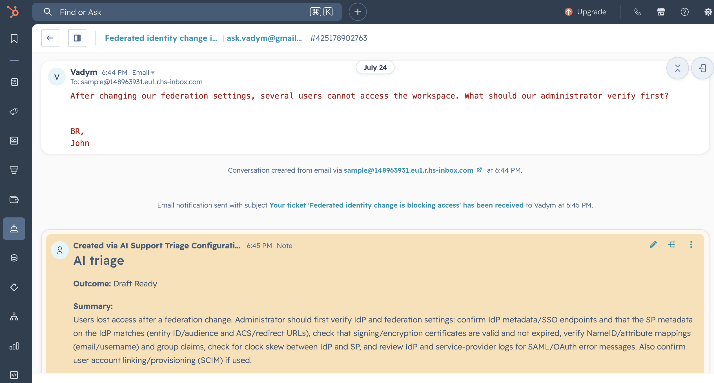
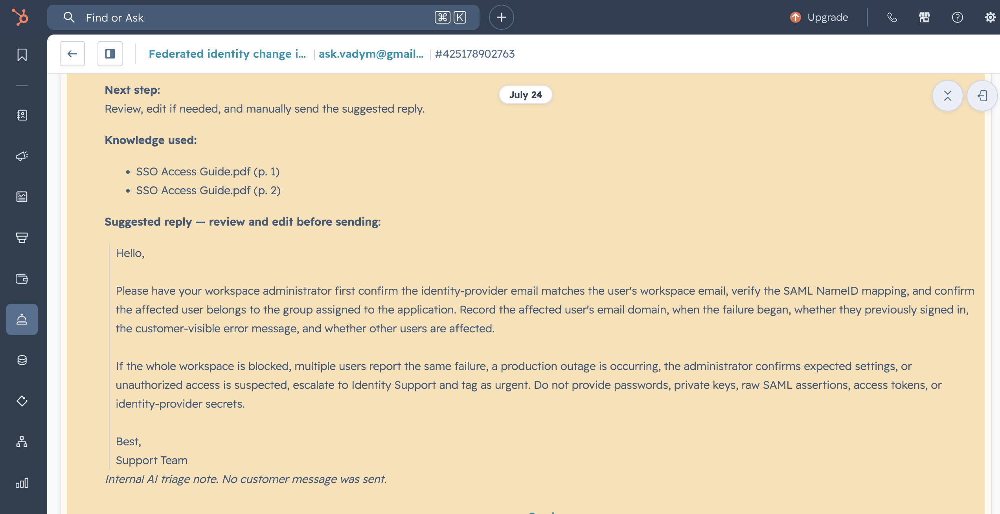
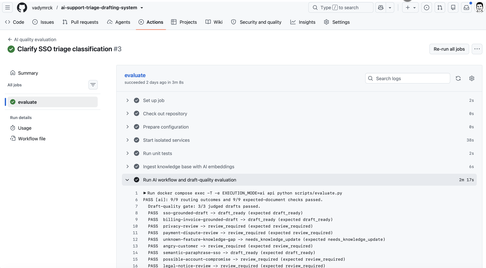
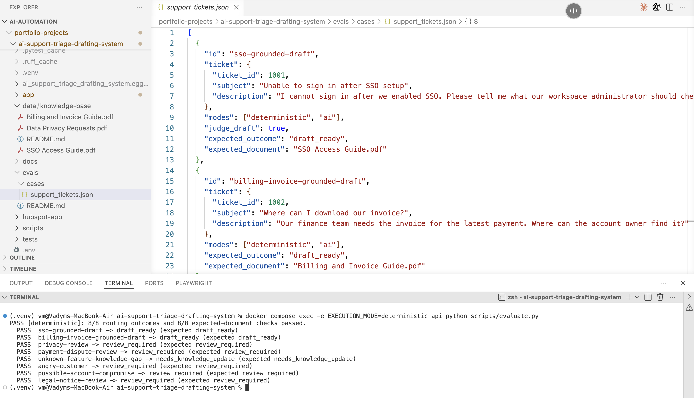

# AI Support Triage & Drafting System

> A human-approved support workflow that classifies HubSpot tickets, retrieves grounded answers from PDF knowledge, and prepares internal triage context or a suggested response.

All tickets and knowledge-base documents used by this demo are synthetic.

## Why this exists

Support teams repeatedly interpret incoming tickets, locate relevant internal guidance, decide whether a request is safe to handle normally, and draft similar replies. This project demonstrates a bounded, auditable way to automate that first layer without automating customer communication.

## Version 1 scope

- Receive HubSpot ticket events through a direct webhook integration.
- Use a Python/FastAPI service as the application boundary and workflow orchestrator.
- Ingest synthetic PDF knowledge-base documents into PostgreSQL with pgvector.
- Use LLM structured outputs to classify tickets and extract decision-relevant signals.
- Retrieve relevant PDF passages and generate source-grounded support context.
- Apply deterministic Python policy rules to select the final outcome.
- Write the resulting support package to an internal HubSpot note associated with the ticket.
- Keep every customer reply under human control; the system never posts a public reply.
- Persist a decision trace for auditability and evaluation.

## Final outcomes

| Outcome | Meaning | HubSpot result |
| --- | --- | --- |
| `draft_ready` | The request is understood, permitted by policy, and sufficiently grounded in retrieved documentation. | Private note with an internal summary, cited sources, and a suggested reply for an agent to review and send manually. |
| `review_required` | The request is sensitive, urgent, ambiguous, low-confidence, or otherwise restricted by policy. | Private note with an internal triage brief, escalation reason, and recommended next action. No customer-facing draft. |
| `needs_knowledge_update` | The request is valid, but the knowledge base does not provide adequate or consistent support. | Private note that identifies the evidence gap and recommended knowledge-owner action. No customer-facing draft. |

## Architecture

```text
HubSpot ticket created or updated
        │ webhook (ngrok only for live local verification)
        ▼
FastAPI service
        ├── validates event and fetches ticket details through HubSpot API
        ├── obtains structured LLM analysis
        ├── retrieves relevant PDF chunks from PostgreSQL + pgvector
        ├── applies deterministic policy rules
        ├── persists the decision trace
        └── posts an internal HubSpot note
                  │
                  ▼
          Human agent reviews and sends any public response
```

The FastAPI application owns integration, retrieval, decisioning, and audit persistence. The LLM reports validated observations; it does not determine the final outcome. A pure Python policy module makes the final routing decision and can be tested independently.

## Demo evidence

▶️ [Watch the live video walkthrough on YouTube](https://youtu.be/9anpdUhmeD0)

### Live HubSpot workflow

A synthetic customer email creates a HubSpot ticket. The integration adds a structured internal triage note with the outcome, summary, and next step; it never sends a public reply.



The note shows the PDF pages used as evidence and a suggested response that an agent must review and edit before manually sending.



### Evaluation and quality gates

The committed GitHub Actions workflow validates the AI pipeline end to end: unit tests, AI PDF embeddings, routing and retrieval checks, and LLM-as-a-judge draft-quality scoring.



The deterministic profile provides a no-call local regression check against the version-controlled synthetic ticket fixtures.



## Stack

- Python 3.12, FastAPI, Pydantic v2
- PostgreSQL + pgvector
- SQLAlchemy with direct schema initialization for this demo
- OpenAI API for embeddings and structured output generation
- PDF parsing with page-level source metadata
- HubSpot Tickets API, Notes API, and webhooks
- Docker Compose, pytest, and a synthetic evaluation dataset
- ngrok for optional live HubSpot webhook verification from a local environment

## Local and GitHub-ready operation

The application, database, PDF ingestion, tests, and evaluation suite run locally with Python and Docker Compose. HubSpot remains an optional external integration used to verify the live workflow with a dedicated developer test account; it is not required to run the local services or test the core logic.

`EXECUTION_MODE=deterministic` uses local heuristics, lexical retrieval, and a template draft without OpenAI calls. `EXECUTION_MODE=ai` uses OpenAI for structured analysis, embeddings, and grounded draft generation. Both modes use the same deterministic routing policy.

AI-mode evaluations include an evaluation-only LLM draft-quality judge by default. Use `docker compose exec api python scripts/evaluate.py --no-judge-drafts` for the faster routing-and-retrieval-only run. See the [evaluation plan](docs/evaluation.md) for the rubric and deterministic pass gate.

## Continuous integration

The [AI quality workflow](.github/workflows/ai-quality.yml) runs on every push to `main`, including merged pull requests. It starts fresh Docker services, runs Ruff lint and format checks, runs unit tests, ingests the shipped PDFs with AI embeddings, and runs the full AI evaluation (including the default draft-quality gate). After one-time installation with `./scripts/install_git_hooks.sh`, local commits run Ruff checks and local pushes run `docker compose exec -T api pytest -q`.

Add `OPENAI_API_KEY` as a repository Actions secret before enabling the workflow. It is intentionally not triggered for open pull requests, so API-backed evaluation runs only on trusted `main` code.

The published repository includes synthetic PDFs and ticket fixtures, `.env.example`, Docker setup, database schema initialization, automated tests, an evaluation dataset, and HubSpot configuration instructions. It does not include secrets, customer data, or automatic customer-reply behavior.

The [HubSpot configuration app](hubspot-app/) is version-controlled alongside the FastAPI service. It requests static private-app authorization and ships with a disabled ticket-created webhook subscription; the temporary tunnel URL and activation remain local deployment steps.

## Documentation

- [Project brief](docs/project-brief.md)
- [Architecture and integration boundary](docs/architecture.md)
- [Decision policy](docs/decision-policy.md)
- [Local setup and HubSpot verification](docs/setup.md)
- [Evaluation plan](docs/evaluation.md)
